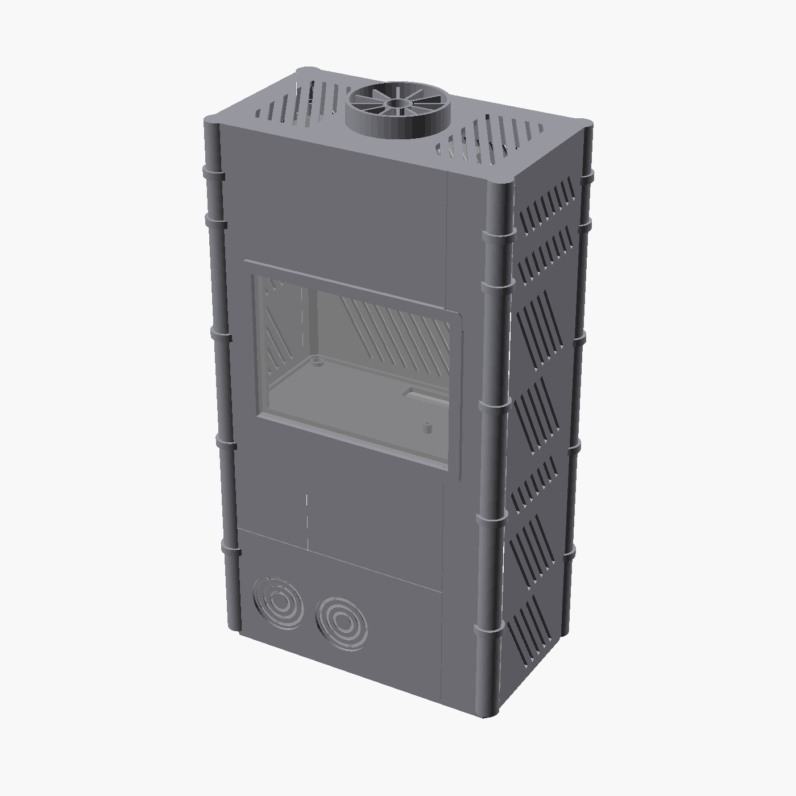

# Tower enclosure

A stackable enclosure for the whole stack, so it can sit next to the box in
the living room: Pi, 7-port hub, 5" screen, 2.5" drives and the power strip
with its bricks. Designed for resin printing on an Anycubic Photon Mono M7
(plate 223 × 126 × 230 mm); every stage fits the plate on its own.

The look: a closed hull with its machinery showing. Four conduit pipes run
up the corners with a collar on every stage, a round exhaust stack with
radial fins sits over the fan, two round intake ports with ring grilles feed
the base, slanted louvres cover the sides and the back, and thin panel lines
run across the front. Every opening is a real one: the tower breathes through
all of them.

## Stages, bottom to top

| Stage | Height | Holds |
| :--- | :--- | :--- |
| `base` | 130 mm | 3-outlet power strip lying flat (up to 195 × 70 × 48 mm, a Legrand extra-flat 3-way fits with room to spare), both bricks plugged in, standing up to 80 mm tall. Mains cord and Ethernet leave through two slots in the rear wall. Air comes in through the floor slots, on rubber feet. |
| `riser` | 30 mm | Empty. Slip one under any stage that needs more height, for a taller brick or a thicker drive. |
| `hub` | 34 mm | The 7-port hub, USB ports facing the rear through a slot. |
| `compute` | 124 mm | The screen, sunk in a pocket of the front face and held from inside by two `screen_clip` bars. The Pi on four standoffs at the right rear, ports facing inwards, so every cable stays inside. |
| `disk` | 32 mm | One 2.5" drive in its enclosure. Print one per drive, stack as many as needed. |
| `lid` | 16 mm | 40 mm exhaust fan under a honeycomb grille. |

Each stage has a plug underneath that drops into the stage below, with four
6 × 2 mm magnets per joint. A 36 × 14 mm pass-through at the rear of every
floor lets the cables run up and down the tower. The louvres share the same
angle and pitch on every stage, so the pattern reads as one across the
stack; the front only gets the two intake ports, low on the base.

Outer size: 210 × 120 mm over the pipes, about 385 mm tall with two disk stages and the stack.

## Files

- `tower.scad`: the parametric model. Open it in [OpenSCAD](https://openscad.org),
  pick a `part` at the top (or `openscad -D 'part="base"' -o base.stl tower.scad`).
  `assembly` shows the stack exploded, with ghosts of the parts to check the room.
- `stl/`: one STL per part, exported from the current parameters.
- `renders/`: reference pictures.

## Before printing

Everything is sized generously. Measure the real parts and adjust the
`components` block at the top of `tower.scad`, then re-export:

| Parameter | What to measure |
| :--- | :--- |
| `strip` | Power strip L × W × H, lying flat. The base height must be at least strip height + brick height; otherwise add a `riser`. |
| `hub` | Hub L × W × thickness. |
| `screen`, `screen_t` | Screen with its frame W × H, and the frame thickness that sits in the pocket. |
| `disk_bay` | Largest drive L × W × thickness. |
| `fan` | 40 mm fan assumed (Noctua NF-A4x10 5V PWM). |

Print settings for ABS-like resin: trays rim up, lid top down, tilted 10 to 15°
on two axes, medium supports under the rim and the bosses. Walls are 2.5 mm,
floors 3.5 mm; the floor slots double as drain holes. The louvres are 2.6 mm
wide, wide enough to drain and to clean with a brush. The lid prints top
down: its stack and fins need supports.

## Hardware

- 20 magnets 6 × 2 mm (4 per joint), glued
- 4 M2.5 × 6 screws for the Pi, 4 M3 × 8 for the screen clips, 4 M3 × 20 for the fan
- 4 self-adhesive rubber feet, 12 mm
- Noctua NF-A4x10 5V PWM fan, driven from the Pi GPIO
- Short cables: micro-HDMI to HDMI, USB-A to micro-USB (screen), USB-C (Pi power)
- Optional: a 5 V addressable LED strip (WS2812) on the Pi GPIO, stuck inside behind the louvres
